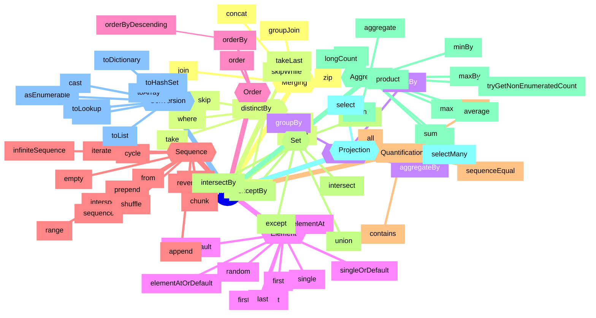

# jinq.js

JavaScript Integrated Query for generators and arrays.
Inspired by .NET's [LINQ](https://docs.microsoft.com/en-us/dotnet/api/system.linq.enumerable) and Elixer's [Enum](https://hexdocs.pm/elixir/Enum.html)erable

For JavaScript and NodeJs

- [Installation](#installation)
- [Usage examples](#usage-examples)
- [How jinq deviates from LINQ](#how-jinq-deviates-from-linq)
- [Enumerable methods](#enumerable-methods)
  - [Static methods](#static-methods)
- [Alternatives](#alternatives)
  - [Static Alternatives](#static-alternatives)
- [Missing functions?](#missing-functions)
- [MindMap](#mindmap)

### Installation

For now™ use:

```shell
$ npm i github:A1rPun/jinq.js
```

And then import it like:

```js
import { jinq } from 'jinq';
```

### Usage examples

Use `jinq.from` to construct an Enumerable from an iterator or an array.

```js
function* generator() {
  yield 1;
  yield 2;
  yield 3;
}

const numberText = jinq
  .from(generator())
  .skip(2)
  .take(1)
  .select((n) => `The number: ${n}`)
  .single();

numberText === 'The number: 3'; // true
```

Use `jinq.range` to construct a generated sequence of numbers.

```js
const bigRange = jinq.range(0, Number.MAX_SAFE_INTEGER);

bigRange.any(); // true
bigRange.take(2).toList(); // [0, 1]
```

### How jinq deviates from LINQ

- `IEqualityComparer` is not implemented for most functions that use it
- `IOrderedEnumerable` is not implemented
- Added functions like `cycle` & `intersperse` that are inspired by Haskell & Elixer

### Enumerable methods

JavaScript has numerous built in methods to do operations on arrays, not so much for generators. This library focuses primarely on generators because of the lazy loading with yields.

Method|Returns value|Description
--|--|--
aggregate()|:white_check_mark:|
aggregateBy()|:white_check_mark:|
all()|:white_check_mark:|
any()|:white_check_mark:|
append()||
asEnumerable()||
average()|:white_check_mark:|
cast()||Accepts a type as parameter e.g. `String`, `Number` or `Boolean`
chunk()||
concat()||
contains()|:white_check_mark:|
count()|:white_check_mark:|
countBy()|:white_check_mark:|
cycle()||Not in LINQ, produces infinite list
defaultIfEmpty()||
distinct()||
distinctBy()||
elementAt()|:white_check_mark:|Can throw an error
elementAtOrDefault()|:white_check_mark:|
except()||
exceptBy()||
first()|:white_check_mark:|Can throw an error
firstOrDefault()|:white_check_mark:|
groupBy()||
groupJoin()||
intersect()||
intersectBy()||
intersperse()||Not in LINQ
join()||
last()|:white_check_mark:|Can throw an error
lastOrDefault()|:white_check_mark:|
longCount()|:white_check_mark:|
max()|:white_check_mark:|
maxBy()|:white_check_mark:|
min()|:white_check_mark:|
minBy()|:white_check_mark:|
ofType()||
order()||Doesn't return an IOrderedEnumerable
orderBy()||Doesn't return an IOrderedEnumerable
orderByDescending()||Doesn't return an IOrderedEnumerable
prepend()||
product()|:white_check_mark:|Not in LINQ
random()|:white_check_mark:|Not in LINQ, Uses Mulberry32 for seeded RNG
reverse()||
scan()||Not in LINQ
select()||
selectMany()||
sequenceEqual()|:white_check_mark:|
shuffle()||Uses Mulberry32 for seeded RNG
single()|:white_check_mark:|Can throw an error
singleOrDefault()||
skip()||
skipLast()||
skipWhile()||
sum()|:white_check_mark:|
take()||
takeLast()||
takeWhile()||
toArray()|:white_check_mark:|
toDictionary()|:white_check_mark:|
toHashSet()|:white_check_mark:|
toList()|:white_check_mark:|Same as toArray()
toLookup()|:white_check_mark:|
tryGetNonEnumeratedCount()|:white_check_mark:|Returns the count if enumerated, otherwise undefined
union()||
unionBy()||
where()||
zip()||

#### Static methods

Method|Description
--|--
jinq.empty()|
jinq.from()|
jinq.infiniteSequence()|Produces infinite list
jinq.iterate()|Not in LINQ, produces infinite list
jinq.range()|
jinq.repeat()|
jinq.sequence()|Can produce an infinite list

### Alternatives

Jinq/[LINQ](https://docs.microsoft.com/en-us/dotnet/api/system.linq.enumerable)|[JavaScript](https://developer.mozilla.org/en-US/docs/Web/JavaScript/Reference/Global_Objects/Array)|[Haskell](https://hackage.haskell.org/package/base-4.21.0.0/docs/Data-List.html)|[Elixer](https://hexdocs.pm/elixir/main/enum-cheat.html)
--|--|--|--
aggregate()|Array.reduce()|foldl, foldr|reduce(), reduce_while()
aggregateBy()|Array.reduce()|foldl, foldr|reduce(), reduce_while()
all()|Array.every()|all, and|all?()
any()|Array.some()|any, or, null|any?(), empty?()
append()|Array.push()|-|-
asEnumerable()|yield* Iterator|-|-
average()|Array.reduce()|-|-
cast()|Array.map()|-|-
chunk()|-|-|chunk_by(), chunk_every(), chunk_while()
concat()|Array.concat()|concat|concat()
contains()|Array.includes()|elem, notElem|member()
count()|Array.length|length|count(), count_until()
countBy()|Array.reduce()|length|-
cycle()|while(true) yield* array|cycle|Stream.cycle()
defaultIfEmpty()|Array.length ? Array : [defaultValue]|-|-
distinct()|-|nub|uniq()
distinctBy()|-|nubBy|uniq_by()
elementAt()|Array.at() ?? throw new Error()|-|at(), fetch()
elementAtOrDefault()|Array.at() ?? defaultValue|-|at(), fetch()
except()|Array.filter()|-|reject()
exceptBy()|Array.filter()|-|reject()
first()|Array.at(0) ?? throw new Error()|head, init, find|find()
firstOrDefault()|Array.at(0) ?? defaultValue|head, init|find()
groupBy()|-|-|group_by()
groupJoin()|-|-|-
intersect()|-|intersect|-
intersectBy()|-|intersectBy|-
intersperse()|-|intersperse|intersperse()
join()|-|-|-
last()|Array.at(-1) ?? throw new Error()|last, tail|-
lastOrDefault()|Array.at(-1) ?? defaultValue|last, tail|-
longCount()|Array.length|length|count(), count_until()
max()|Array.reduce()|maximum|max()
maxBy()|Array.reduce()|maximumBy|max_by()
min()|Array.reduce()|minimum|min()
minBy()|Array.reduce()|minimumBy|min_by()
ofType()|Array.filter()|-|-
order()|Array.sort()|sort|sort()
orderBy()|Array.sort()|sortOn|sort_by()
orderByDescending()|Array.sort()|sortOn|sort_by()
prepend()|Array.unshift()|-|-
product()|-|product|product()
random()|Array.at(Math.random()*Array.length)|-|random()
reverse()|Array.reverse()|reverse|reverse(), reverse_slice()
scan()|-|scanl, scanr|scan()
select()|Array.map()|map|map(), map_every()
selectMany()|Array.flatMap()|-|flat_map()
sequenceEqual()|Array.all()|-|-
shuffle()|-|-|shuffle()
single()|Array.at(index) ?? throw new Error()|-|-
singleOrDefault()|Array.at(index) ?? defaultValue|-|-
skip()|Array.slice()|drop|drop(), drop_every()
skipLast()|Array.slice()|-|-
skipWhile()|Array.slice()|dropWhile|drop_while()
sum()|Array.reduce()|sum|sum(), sum_by()
take()|Array.slice()|take|slice(), take(), take_every()
takeLast()|Array.slice()|-|-
takeWhile()|Array.slice()|takeWhile|take_while()
toArray()|[...Iterator]|-|to_list()
toDictionary()|new Map(Array)|-|-
toHashSet()|new Set(Array)|-|-
toList()|[...Iterator]|-|to_list()
toLookup()|new Map(Array)|-|-
tryGetNonEnumeratedCount()|Array.length|length|count(), count_until()
union()|-|union|-
unionBy()|-|unionBy|-
where()|Array.filter()|filter|filter()
zip()|-|zip|zip(), zip_reduce(), zip_with()

#### Static Alternatives

Jinq/Linq|JavaScript|Haskell|Elixer
--|--|--|--
jinq.empty()|[]|[]|[]
jinq.from()|[]|[]|[]
jinq.infiniteSequence()|while(true) yield element|repeat|-
jinq.iterate()|while(true) yield element|iterate|-
jinq.range()|for(let i..) yield element|-|-
jinq.repeat()|for(let i..) yield element|replicate|-
jinq.sequence()|-|-|-

### Missing functions?

- List ForEach() | Elixer each() or too side-effect prone?
- LINQ IList functions like FindIndex()?
- LINQ AsyncEnumerable
- LeftJoin, RightJoin
- [Elixer Enum](https://hexdocs.pm/elixir/Enum.html)
dedup(), dedup_by(), find_index(), find_value(), flat_map_reduce(), frequencies(), frequencies_by(), into(), join(), map_intersperse(), map_join(), map_reduce(), min_max(), min_max_by(), product_by(), slide(), split(), split_while(), split_with(), take_random(), unzip(), with_index()
- [Haskell Data.List](https://hackage.haskell.org/package/base-4.21.0.0/docs/Data-List.html)
uncons, unsnoc, single, intercalate, transpose, subsequences, permutations, concatMap, mapAccumL, mapAccumR, unfoldr, splitAt, dropWhileEnd, span, break, stripPrefix, group, groupBy, inits, tails, isPrefixOf, isSuffixOf, isInfixOf, isSubsequenceOf, lookup, partition, elemIndex, elemIndices, findIndex, findIndices, zipWith, unzip, insert, insertBy, delete, deleteBy, deleteFirstBy

### MindMap


Inspired by [this mindmap](https://steven-giesel.com/blogPost/00443661-f75b-4694-852b-175b4a10d6c4)
